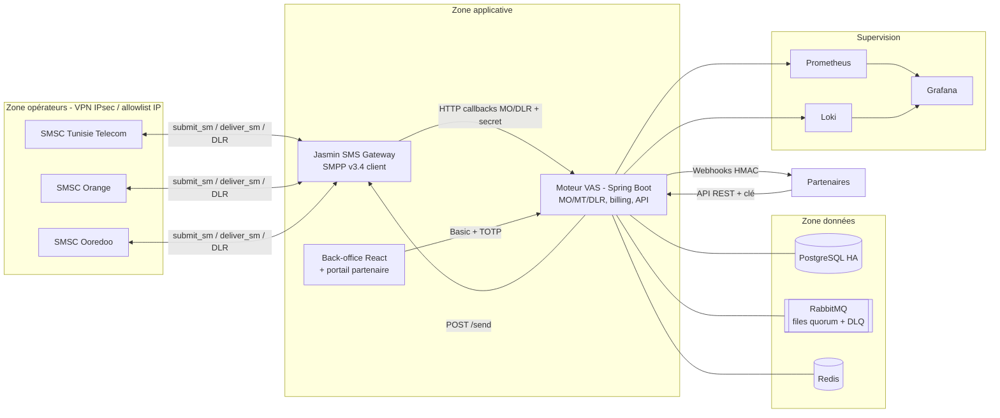

# Dossier d'architecture - HLD

Plateforme VAS / SMS Premium - SMPP v3.4 - Tunisie Telecom, Orange Tunisie, Ooredoo Tunisie.

## 1. Principes (CDC §4.1)

| Principe | Réalisation |
|---|---|
| Séparation télécom / métier | Jasmin transporte et route les SMS ; toute la logique (services, consentement, billing, partenaires) est dans l'application. L'interface `SmsGateway` isole la gateway (Jasmin aujourd'hui, Kannel demain) |
| Modularité | Couches `gateway` / `service` / `repo` / `web` / `security`, aucun monolithe de scripts |
| Configuration par environnement | Variables d'environnement ; paramètres opérateur dans Jasmin et en base (`operator`), jamais dans le code |
| Asynchrone | MT : base → file RabbitMQ (3 priorités) → dispatcher ; callbacks partenaires : outbox → sender planifié |
| Idempotence | MO : clé unique `(operator, dedup_key)` + fenêtre contenu ; MT : un MT non `PENDING` n'est jamais renvoyé ; DLR : un statut final n'est jamais écrasé ; ledger : `event_id` unique ; API : `clientRef` ; webhooks : `event_id` |
| Traçabilité | En-tête `X-Correlation-Id` → MDC `corr` dans tous les logs JSON ; `correlation_id` MT ↔ `message_id` SMSC ; historique des statuts ; audit |
| Observabilité | `/actuator/prometheus`, compteurs `vas_mo_total`, `vas_mt_total`, jauge `vas_mt_pending`, dashboards Grafana, logs Loki |

## 2. Vue d'ensemble

## 3. Flux principaux

**MO** : opérateur → `deliver_sm` → Jasmin → `POST /callbacks/mo` → `MoService` (dédoublonnage, règles, routage, consentement) → réponse MT en file → ledger si facturable → webhook MO partenaire. Réponse `ACK/Jasmin` ; une erreur interne renvoie HTTP 500 et Jasmin rejoue (MO-007).

**MT** : API ou réponse MO → `MtService.submit` (persistance `PENDING`, taille/segments, ledger ouvert) → publication RabbitMQ après commit → `MtDispatcher` (limiteur TPS opérateur, validité) → Jasmin `POST /send` → `SUBMITTED` + ID SMSC. En cas d'échec retryable : reste `PENDING`, le balayeur republie (zéro perte, y compris après crash/redémarrage).

**DLR** : opérateur → Jasmin → `POST /callbacks/dlr?cid=` → `DlrService` : statut brut + normalisé, historique, bascule du ledger (`CHARGED`/`REJECTED`/`DISPUTED` selon la règle `ON_DELIVERED`/`ON_SUBMITTED` de l'opérateur), webhook partenaire signé.

## 4. Zones réseau et sécurité

| Zone | Contenu | Règles |
|---|---|---|
| Opérateurs | VPN IPsec, Jasmin (ports SMPP sortants) | allowlist IP opérateur ; HTTP API Jasmin (1401) et jcli (8990) jamais publiés |
| Applicative | Application ×2, UI | seul HAProxy/nginx exposé en HTTPS ; callbacks par secret + réseau interne |
| Données | PostgreSQL, RabbitMQ, Redis | aucun accès depuis l'extérieur ; mots de passe distincts |
| Administration | bastion SSH (clés), Grafana, Prometheus | accès par VPN d'administration |

## 5. Dimensionnement et disponibilité (CDC §12)

- Cible : 50 SMS/s/opérateur soutenus, extensible à 200 SMS/s agrégés (ajout d'instances applicatives, consommateurs RabbitMQ, connecteurs Jasmin supplémentaires par opérateur dans la limite des contrats).
- Topologie HA de référence : `infra/ha/docker-compose.ha.yml` (PostgreSQL Patroni synchrone, RabbitMQ 3 nœuds quorum, Redis + Sentinel, 2 instances applicatives, Jasmin actif/passif). RPO ≈ 0 en mode synchrone, RTO cible ≤ 2 h (restauration complète mesurée à quelques secondes sur le jeu de test, voir `12-rapport-tests.md`).
- Dégradation : Redis indisponible → quotas API refusent par prudence (à adapter) ; RabbitMQ indisponible → les MT restent `PENDING` en base et repartent au retour (balayeur) ; PostgreSQL indisponible → callbacks en erreur HTTP 500, Jasmin rejoue.

## 6. Décisions d'architecture

| Décision | Choix | Alternatives écartées |
|---|---|---|
| Gateway | Jasmin (open source, SMPP client/serveur, files, DLR) | Kannel (acceptable), développement SMPP maison (coût/risque inutiles) |
| Backend | Java 21 / Spring Boot 3 | Node/Python/Go : équivalent, mais écosystème transactionnel et sécurité Spring mûr |
| Base | PostgreSQL | - |
| Queue | RabbitMQ quorum | Kafka : surdimensionné pour 200 msg/s |
| Cache/quotas | Redis 7.2 (BSD) ou Valkey | Redis ≥ 7.4 (licence non OSI) |
| UI | React (Vite) | - |
| Intégration Jasmin | HTTP API + callbacks | Pas de dépendance à jcli à l'exécution ; le provisioning est scripté (`infra/jasmin`) |
